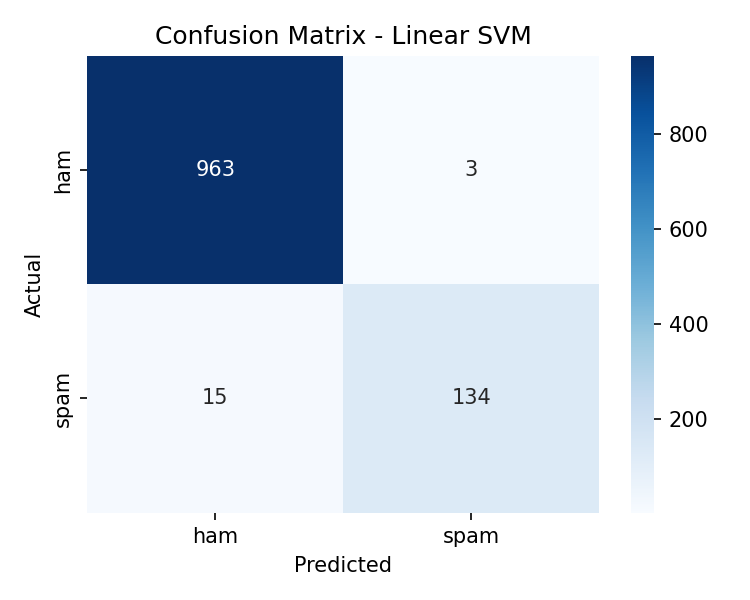
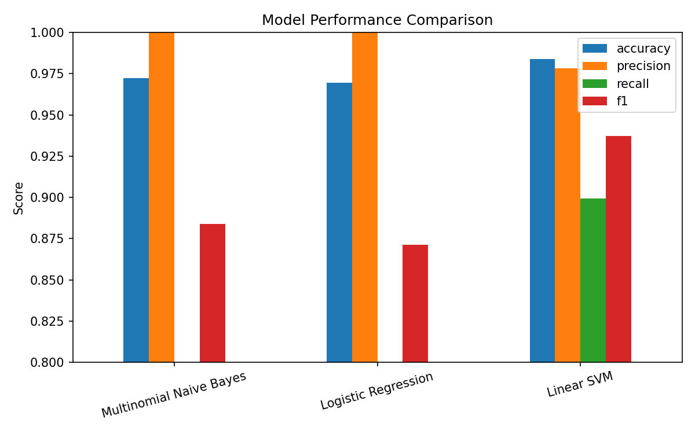

# Task 1: Email Spam Classification

**Arch Technologies — Machine Learning / Data Science Internship**
Author: Ali Rashid

## Overview
Builds and compares machine learning models that classify SMS/email
messages as **spam** or **ham** (not spam), using a labelled dataset.

## Pipeline
1. Load labelled dataset (`sms.tsv` — 5,572 messages, ham/spam)
2. Clean text (lowercase, strip URLs/numbers/punctuation, remove stopwords)
3. TF-IDF vectorization (unigrams + bigrams, 3,000 features)
4. Train & compare 3 models: Multinomial Naive Bayes, Logistic Regression, Linear SVM
5. Evaluate on a held-out test set (accuracy, precision, recall, F1)
6. Save confusion matrix + comparison chart

## Results

| Model | Accuracy | Precision | Recall | F1-score |
|---|---|---|---|---|
| Multinomial Naive Bayes | 97.2% | 100% | 79.2% | 0.884 |
| Logistic Regression | 97.0% | 100% | 77.2% | 0.871 |
| **Linear SVM (best)** | **98.4%** | 97.8% | 89.9% | **0.937** |




## How to run
```bash
pip install -r requirements.txt
python spam_classifier.py
```

## Files
- `spam_classifier.py` — full pipeline (preprocessing, training, evaluation)
- `sms.tsv` — labelled dataset
- `confusion_matrix.png`, `model_comparison.png` — result plots
- `model_comparison.csv` — metrics table
- `report.pdf` — full submission report
